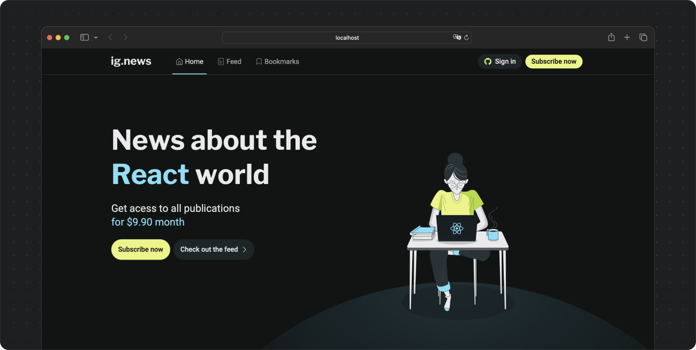
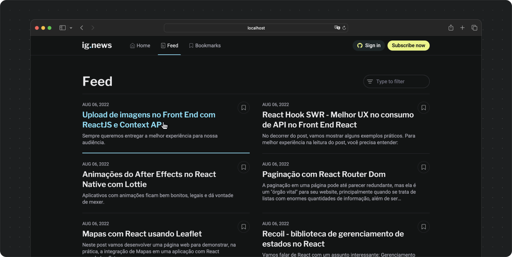
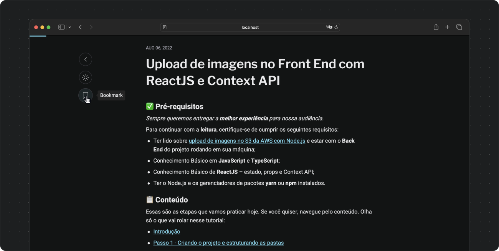
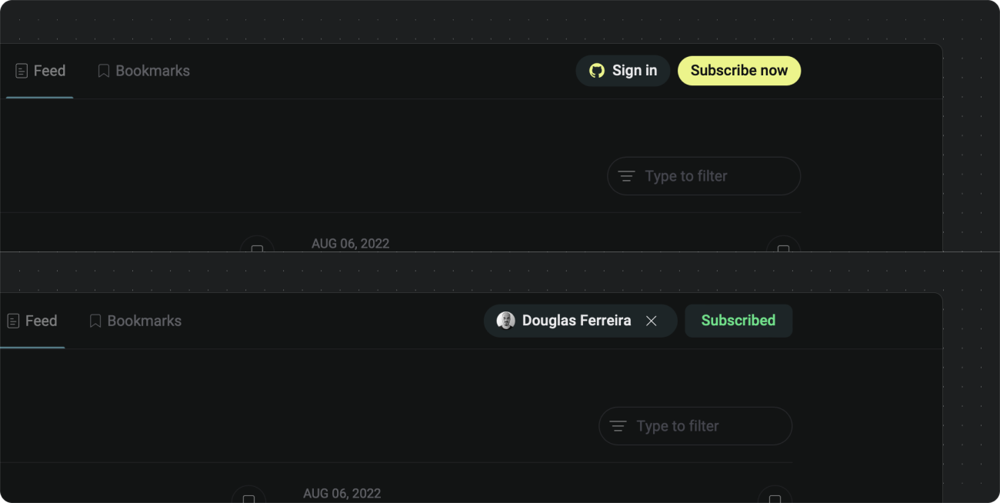

# IgNews - Exercise 6 from Ignite course by Rocketseat

- [About](#about)
- [Project screenshots](#project-screenshots)
- [Extra notes](#extra-notes)

 

## About

IgNews is a subscription-based news website about ReactJS, built using NextJS, FaunaDB, Prismic CMS and Stripe.

Tools used:

- Typescript
- ReactJS
- NextJS
- Axios
- Prismic CMS
- FaunaDB
- Stripe
- SASS
- Framer Motion
- SVGR

 

## Project screenshots

 
<small>Application home.</small>

 

 
<small>Feed with list of posts.</small>

 

 
<small>Blog post in reading mode.</small>

 

 
<small>Dynamic header show users log in and subscription statuses.</small>

 

## Extra notes

- As an exercise, this project wasn’t focused on advanced optimizations regarding data storage, processing, accessibility, scalability, cross-browser compatibilities, etc. There’s still a lot to be done about it.
- As most projects, this one is not bug/error-free. If you find any bug or unexpected behavior, feel free to get in touch, here is my email - dfaferreira46@gmail.com
